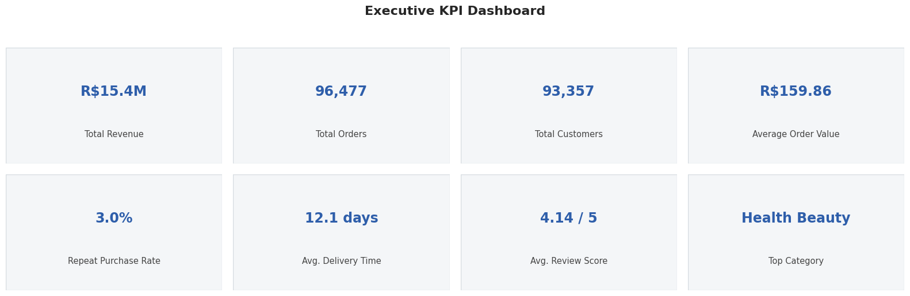
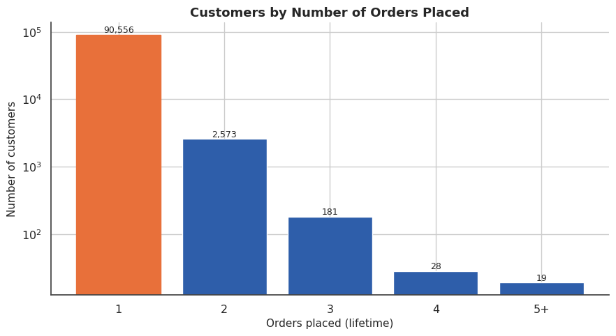
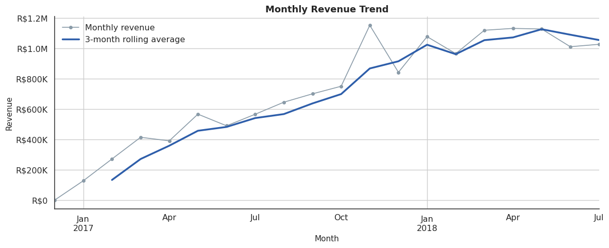
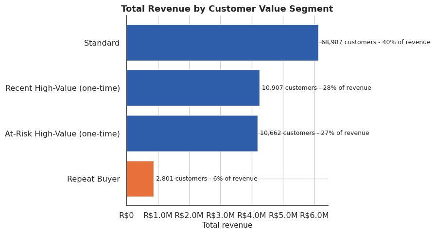
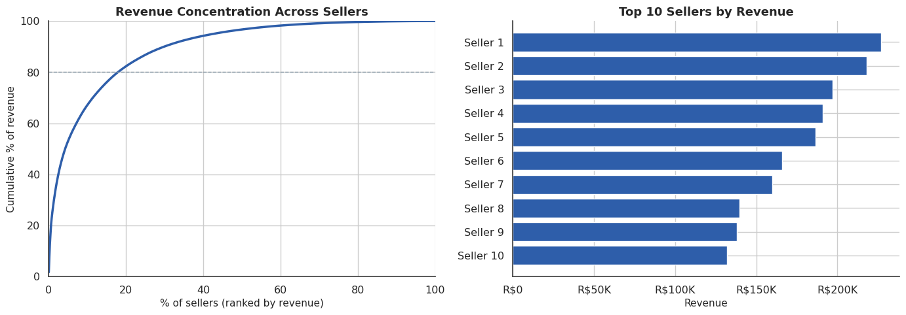
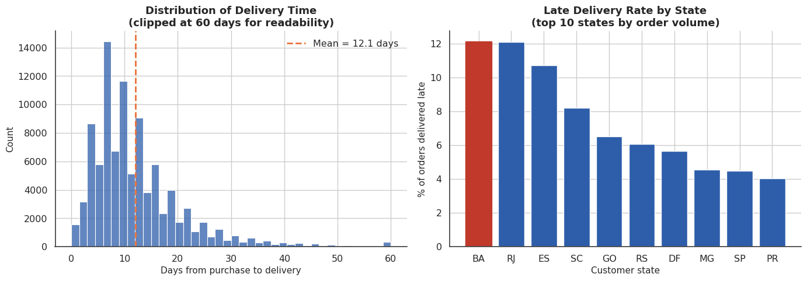
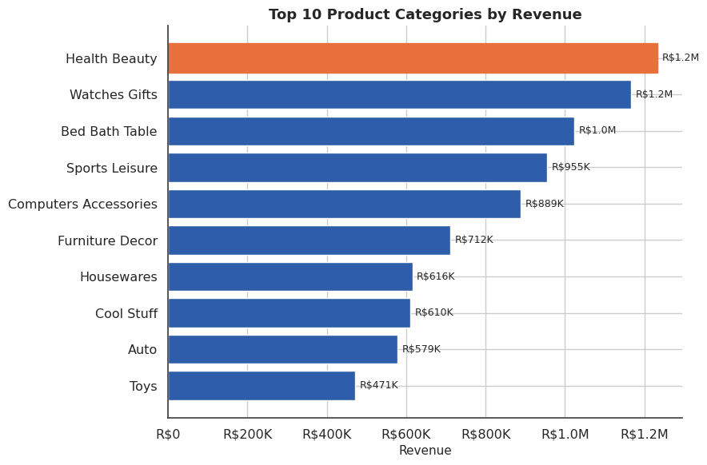

# Customer Intelligence Platform: End-to-End E-commerce Analytics

A production-style analytics case study on the Olist Brazilian e-commerce dataset — built as a Data Analyst portfolio project, not a Kaggle notebook. It answers eight concrete business questions across customer, product, seller, delivery, payment, and revenue analytics, backed by a modular Python package and reproducible SQL.



---

## Project Overview

Olist is a Brazilian marketplace that connects small and medium-sized merchants to major e-commerce channels through a single integration. This project uses Olist's public order-level dataset (~100K orders, Sep 2016 – Aug 2018, across 8 relational tables) to build a single analytical base table and answer the questions a marketplace COO, Head of Growth, and Head of Logistics would each bring to this data.

The emphasis throughout is **business reasoning over technique for its own sake**: every chart answers a stated question, every feature has a stated business purpose, and every recommendation is tied to a specific finding.

## Business Problem

Marketplaces don't sell to customers directly — they broker a relationship between many small sellers and many buyers, and are paid on take-rate and logistics economics. That creates three competing priorities: **growth** (new buyer acquisition), **retention** (lifetime value depends on whether a customer returns), and **operations** (delivery performance and seller quality are the two levers the platform actually controls). Without a unified, order-level view across nine source tables, none of these can be answered with confidence.

## Business Objectives

1. Who are the highest-value customers?
2. Which product categories generate the highest revenue?
3. Which sellers consistently underperform?
4. How do delivery delays affect customer satisfaction?
5. Which regions generate the highest sales?
6. Which payment methods are most common?
7. Which customers are likely to become repeat buyers?
8. Which operational issues reduce customer experience?

## Dataset

[Olist Brazilian E-Commerce Public Dataset](https://www.kaggle.com/datasets/olistbr/brazilian-ecommerce) — ~100K orders across 8 CSVs (orders, order items, payments, reviews, customers, products, sellers, category translation). Full data dictionary and table relationships are documented in the notebook (Sections 4–6). The zip-code-level geolocation table is intentionally excluded — see the notebook for the reasoning.

## Architecture

```
Raw CSVs (data/)
      │
      ▼
src/cleaning.py            → load_data(), clean_data(), get_product_catalog()
      │
      ▼
src/feature_engineering.py → create_features(), build_customer_level_table()
      │
      ▼
src/analysis.py             → calculate_kpis(), calculate_rfm(), analyze_*()
      │
      ▼
src/visualization.py        → plot_*() — every chart returns a matplotlib Figure
      │
      ▼
notebooks/Customer_Intelligence_Platform.ipynb   (presentation layer only)
      │
      ▼
Business Insight → Business Impact → Recommendation  (after every chart)
```

The notebook is intentionally thin: it calls functions from `src/` and narrates the result. All reusable logic — cleaning, feature engineering, KPI math, chart construction — lives in the package, the same separation a production analytics codebase would use.

## Project Workflow

1. **Load & clean** nine raw tables into one order-level analytical base table (`clean_data()`), with an explicit, documented rationale for every drop/dedup decision (Data Quality Assessment, notebook Section 7).
2. **Engineer features** — delivery delay, repeat-customer flag, customer tenure, review category, CLV approximation (`create_features()`, `build_customer_level_table()`).
3. **Answer each business objective** in its own notebook section, backed by a reusable `analyze_*()` / `plot_*()` function pair.
4. **Segment customers** with a value-tiered approach adapted to this dataset's real repeat-purchase rate, rather than a mechanical RFM score.
5. **Synthesize** into prioritized, numbered executive recommendations.

## Tech Stack

- **Python**: pandas, NumPy — data integration and feature engineering
- **Visualization**: Matplotlib, Seaborn — custom house style (`src/utils.py`), no default styling
- **SQL**: PostgreSQL-dialect scripts reproducing the core notebook analyses using CTEs, window functions, and ranking functions
- **Jupyter**: presentation layer only — see [Architecture](#architecture)

## Key KPIs

| Metric | Value |
|---|---|
| Total revenue (delivered orders) | R$ 15.4M |
| Delivered orders | 96,477 |
| Unique customers | 93,357 |
| Average order value | R$ 159.86 (median R$ 105.28) |
| Repeat purchase rate | 3.0% |
| Average delivery time | 12.1 days |
| Late delivery rate | 6.8% |
| Average review score | 4.14 / 5 |
| Top category by revenue | Health & Beauty |
| Top-10-seller revenue share | 13.3% (of 2,970 sellers) |
| Underperforming sellers flagged | 137 (of 1,238 sellers with ≥10 orders) |

## Business Questions & Where They're Answered

| Question | Notebook Section | Key Finding |
|---|---|---|
| Highest-value customers? | 10. Customer Analytics | Top spenders are almost entirely one-time buyers, not repeat customers |
| Top revenue categories? | 11. Product Analytics | Top 10 of 71 categories = 63% of category revenue |
| Underperforming sellers? | 12. Seller Analytics | 137 sellers combine high late-delivery rates with sub-3.5 review scores |
| Delivery delay → satisfaction? | 13–15. Delivery & Satisfaction | On-time 4.28/5 vs. late 2.26/5 — a 2-point swing |
| Highest-sales regions? | 16. Geographic Analysis | SP/RJ/MG = 62.5% of revenue |
| Common payment methods? | 14. Payment Analysis | Credit card = 75.5% of orders, highest AOV, avg. 3.5 installments |
| Likely repeat buyers? | 18. RFM Segmentation | First-order value/review score barely differ by repeat status — repeat behavior isn't well predicted by first-order signals alone |
| Operational satisfaction drivers? | 13–15 | Delivery reliability is the clearest measurable lever |

## Methodology

- **Analytical base cut**: only `delivered` orders are used for revenue/delivery/satisfaction metrics — canceled and in-transit orders are excluded with the rationale stated explicitly (not silently dropped).
- **Customer identity**: Olist assigns a new `customer_id` per order; all customer-level and repeat-purchase analysis joins through `customer_unique_id`, the true customer key.
- **RFM, adapted honestly**: 97% of customers have `frequency == 1`, which makes a textbook 5×5×5 RFM quintile score misleading (most customers tie on Frequency). Segmentation here leans on Recency and Monetary value instead, with Frequency used only to carve out genuine repeat buyers — see notebook Section 18 for the full reasoning.
- **No predictive model**: "which customers are likely to repeat" is answered descriptively (comparing first-order characteristics of repeaters vs. non-repeaters), not with a classifier — a proper model needs a train/holdout design and is scoped as future work, not overclaimed here.

## Key Findings

1. **Retention is the single biggest structural gap** — only 3.0% of customers ever place a second order; growth to date has been almost entirely acquisition-driven.
2. **Delivery reliability is a measurable satisfaction driver** — late orders score roughly two points lower on average than on-time orders.
3. **Revenue is geographically concentrated but seller-diversified** — SP/RJ/MG dominate demand, but no single seller dominates supply (healthy long tail).
4. **A small, identifiable high-value one-time-buyer segment exists** and is the highest-leverage target for a retention pilot — see RFM Segmentation.
5. **Payment financing (installments) is structurally tied to order size**, making it a leading indicator worth tracking independently of AOV.

## Business Recommendations

| Priority | Action | Rationale |
|---|---|---|
| 1 | Pilot a win-back offer targeted at "At-Risk High-Value (one-time)" customers | Smallest, most defensible test of the retention opportunity |
| 2 | Make on-time delivery rate a headline KPI; add service recovery for late orders | Largest single measurable driver of review score |
| 3 | Move to state-tiered estimated delivery dates | Directly reduces the *late rate* metric and closes the geography/satisfaction gap |
| 4 | Track average installments as a leading AOV indicator | Financing availability appears structurally tied to order size |
| 5 | Invest in seller quality/logistics support in the long tail, especially outside the Southeast | Addresses delivery variance at its likely source |

## Repository Structure

```
Customer-Intelligence-Platform/
├── README.md
├── requirements.txt
├── LICENSE
├── .gitignore
├── data/                 # raw Olist CSVs
├── notebooks/
│   └── Customer_Intelligence_Platform.ipynb   # presentation layer
├── src/
│   ├── __init__.py
│   ├── cleaning.py             # load_data, clean_data, get_product_catalog
│   ├── feature_engineering.py  # create_features, build_customer_level_table
│   ├── analysis.py             # calculate_kpis, calculate_rfm, analyze_*
│   ├── visualization.py        # plot_* — all charts, house style applied
│   └── utils.py                # currency/pct formatting, validation helpers
├── sql/
│   ├── customer_analysis.sql
│   ├── revenue_analysis.sql
│   ├── seller_analysis.sql
│   ├── delivery_analysis.sql
│   └── payment_analysis.sql
├── images/               # chart exports, embedded above
└── reports/              # one-page executive summary
```

## Screenshots

| Customer Segments | Revenue Trend |
|---|---|
|  |  |

| RFM Segmentation | Seller Performance |
|---|---|
|  |  |

| Delivery Performance | Top Categories |
|---|---|
|  |  |

## How to Run

```bash
git clone <repo-url>
cd Customer-Intelligence-Platform
pip install -r requirements.txt
jupyter notebook notebooks/Customer_Intelligence_Platform.ipynb
```

The notebook imports directly from `src/`, e.g.:

```python
from src.cleaning import load_data, clean_data
from src.feature_engineering import create_features
from src import analysis as A
from src import visualization as V

raw = load_data(data_dir="../data")
order_df = clean_data(raw)
order_df = create_features(order_df)

kpis = A.calculate_kpis(order_df)
fig = V.plot_kpi_dashboard(kpis, top_category, top_seller_revenue)
```

## Future Improvements

- Formal churn/repeat-purchase classification model with a proper train/holdout split (flagged as out of scope in the notebook's conclusion)
- Incorporate freight cost into a margin (not just revenue) view per category/seller
- State-level delivery SLA backtesting using the late-rate-by-state breakdown already computed in `analyze_delivery_performance()`
- Automated dbt models translating the `sql/` scripts into a scheduled warehouse pipeline

## License

MIT — see [LICENSE](LICENSE).
